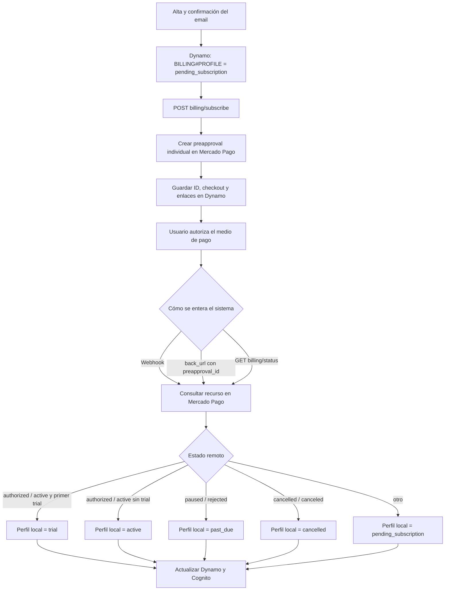

# Sistema de suscripciones con Mercado Pago

Documento elaborado a partir del código vigente al 26 de agosto de 2026.

## Resumen ejecutivo

- La fuente de verdad externa es la suscripción (`preapproval`) de Mercado Pago. DynamoDB conserva una copia local utilizada para decidir si un comercio puede ejecutar operaciones de escritura.
- Crear el checkout **no activa** la cuenta: sólo deja el perfil en `pending_subscription` y guarda el ID de la suscripción y la URL de checkout.
- El sistema considera activada la suscripción cuando consulta Mercado Pago y recibe `authorized` o `active`. Si corresponde el primer trial, guarda `trial`; de lo contrario, `active`.
- La activación puede detectarse por tres caminos: webhook, retorno del checkout y conciliación al consultar `GET /{commerceId}/billing/status`.
- Sí se puede consultar Mercado Pago usando datos guardados: principalmente `currentSubscriptionId`/`mercadoPagoSubscriptionId`; como respaldo existen `billingPayerEmail` y `mercadoPagoPlanId`.
- El dato guardado en DynamoDB es una **copia/cache**, no una garantía del estado actual de Mercado Pago. El último estado remoto sólo se confirma haciendo una nueva consulta a la API de Mercado Pago.
- No existe una Lambda programada, cron ni EventBridge que concilie suscripciones por su cuenta.
- Sin webhook, una cancelación o un cambio de estado en Mercado Pago se descubre cuando un usuario inicia sesión, abre la aplicación, abre/actualiza la pantalla de suscripción o durante el refresco cada cuatro horas de una pestaña abierta.
- Las lecturas y exportaciones de productos, ventas y reportes no consultan Mercado Pago ni exigen suscripción. Las mutaciones comerciales validan la copia local `BILLING#PROFILE` en DynamoDB.
- Sí, la sincronización puede fallar. Ante un error al consultar Mercado Pago, el endpoint de estado devuelve la copia local para no dejar la aplicación indisponible. Eso favorece disponibilidad, pero puede habilitar temporalmente una cuenta cuyo estado remoto ya cambió.

## Componentes y fuentes de estado

| Componente | Responsabilidad |
| --- | --- |
| Mercado Pago `preapproval` | Estado real de la autorización recurrente y próxima fecha de cobro. |
| Mercado Pago `authorized_payments` y `payments` | Resultado de los cobros: aprobado, rechazado, cancelado, reembolsado, etc. |
| DynamoDB `BILLING#PROFILE` | Copia local actual usada por el backend para autorizar mutaciones comerciales. |
| DynamoDB `SUBSCRIPTION#<id>` | Historial local de suscripciones y marcador de activación/trial. |
| Cognito `custom:accountStatus` | Copia del estado para el token y navegación inicial del frontend. No es la validación final del backend. |
| Estado en memoria/local storage del frontend | Ayuda a decidir la navegación. Se reemplaza al consultar el endpoint de billing. |

La autorización efectiva ocurre en `assertCommerceAccess`: siempre valida los claims de comercio/rol y, para mutaciones, lee `COM#<commerceId> / BILLING#PROFILE`. Por lo tanto, ante una diferencia entre Cognito y DynamoDB, las operaciones de escritura toman como referencia DynamoDB. Las lecturas, exportaciones y solicitudes de soporte omiten únicamente la validación de suscripción.

Existe una excepción de compatibilidad: si el comercio no tiene ningún `BILLING#PROFILE`, el backend permite el acceso para no bloquear cuentas anteriores a billing. La ausencia accidental de ese registro también produciría ese bypass.

## Flujo de alta y activación



### 1. Creación de la cuenta

El alta pública crea:

- el comercio;
- el usuario propietario;
- el perfil de billing con `status = pending_subscription`;
- los atributos Cognito `custom:commerceIds`, `custom:accountStatus` y `custom:regId`.

Confirmar el email no activa billing. El usuario queda dirigido a la pantalla de suscripción.

### 2. Creación del checkout

`POST /{commerceId}/billing/subscribe` exige que el actor sea el propietario y que envíe `Idempotency-Key`.

El backend:

1. valida el email de Mercado Pago;
2. verifica que ese email no esté vinculado a otro comercio;
3. decide si corresponde trial usando el perfil y todo el historial `SUBSCRIPTION#*`;
4. crea un `/preapproval` individual en Mercado Pago con `external_reference = commerceId`, importe, moneda, frecuencia mensual y trial cuando corresponde;
5. guarda los registros locales y devuelve `init_point` al frontend.

Los IDs de plan configurados se usan como marcadores y para conciliación/validación local. La creación actual envía un `preapproval` individual con su configuración recurrente; no envía `preapproval_plan_id` en el POST a Mercado Pago.

En este momento el estado local continúa siendo `pending_subscription`. Tener `checkoutUrl` o `subscriptionId` no significa que el usuario haya autorizado el cobro.

### 3. Detección de la activación

Los tres caminos terminan consultando el recurso en Mercado Pago antes de escribir el estado local:

1. **Webhook (camino principal):** acepta los tópicos `subscription_preapproval`, `subscription_authorized_payment` y `payment`. Valida la firma HMAC, obtiene el recurso desde Mercado Pago y sincroniza.
2. **Retorno del checkout:** `GET /billing/mercadopago/return?preapproval_id=...` consulta la suscripción y el último pago autorizado antes de redirigir al frontend. Si falla, igualmente redirige; la pantalla vuelve a intentar la conciliación.
3. **Consulta protegida de estado:** `GET /{commerceId}/billing/status` consulta la suscripción por ID y luego el último `authorized_payment`. Con `forceRefresh=true` no usa la ventana de frescura local.

Al recibir `authorized` o `active`, se actualizan:

- `SUBSCRIPTION#<subscriptionId>.status`;
- `SUBSCRIPTION#<subscriptionId>.activatedAt`;
- `BILLING#PROFILE.status` a `trial` o `active`;
- fechas de trial/período y último estado de pago;
- `lastWebhookAt` o `lastReconciledAt`, según el origen;
- Cognito `custom:accountStatus`.

El email de “trial activado” sólo se crea cuando la activación fue procesada con origen `webhook`. Si la primera activación se recupera únicamente por retorno o conciliación, el estado se actualiza pero ese email no se genera.

## Traducción de estados

### Estado de la suscripción de Mercado Pago

| Estado remoto | Estado local persistido | Efecto |
| --- | --- | --- |
| `authorized`, `active` con trial todavía no consumido | `trial` | Acceso habilitado y trial marcado como consumido. |
| `authorized`, `active` sin trial | `active` | Acceso habilitado. |
| `paused`, `rejected` | `past_due` | Acceso sólo hasta `graceUntil`. |
| `cancelled`, `canceled` | `cancelled` | Acceso sólo hasta `currentPeriodEndsAt`, si esa fecha existe y es futura. |
| Cualquier otro valor, incluido `pending` | `pending_subscription` | Acceso bloqueado. |

No existe un estado persistido `expired`. `expired` es un estado de presentación (`viewState`) calculado para la interfaz a partir del historial, el estado local y las fechas.

### Estado del pago autorizado

Los estados `rejected`, `cancelled`, `canceled`, `refunded` y `charged_back` colocan el perfil en `past_due`, guardan `lastPaymentStatus` y calculan `graceUntil = ahora + BILLING_GRACE_DAYS`.

### Regla local de acceso

| Estado local | Regla aplicada en cada mutación comercial |
| --- | --- |
| `trial` | Siempre permite hasta que una sincronización cambie el estado. `trialEndsAt` no se compara en esta validación. |
| `active` | Siempre permite hasta que una sincronización cambie el estado. `currentPeriodEndsAt` no se compara en esta validación. |
| `past_due` | Permite únicamente mientras `graceUntil >= ahora`. |
| `cancelled` | Permite únicamente mientras `currentPeriodEndsAt >= ahora`. |
| `pending_subscription` | Bloquea con HTTP 402 y código `SUBSCRIPTION_REQUIRED`. |
| Perfil inexistente | Permite por compatibilidad con cuentas legacy. |

Consecuencia: si el perfil queda desactualizado como `trial` o `active`, el paso del tiempo por sí solo no lo vence. Es necesaria una sincronización que cambie el estado local. En cambio, un perfil ya conocido como `past_due` o `cancelled` se bloquea localmente al terminar su fecha de gracia o período, aunque no llegue otro webhook.

## ¿Cuándo se consulta Mercado Pago sin webhook?

| Disparador | ¿Fuerza consulta remota? | Observación |
| --- | --- | --- |
| Login exitoso | Sí | El frontend llama a billing con `forceRefresh=true`. Si falla, registra un warning y continúa con el estado disponible. |
| Cambio obligatorio de contraseña | Sí | Mismo comportamiento que el login. |
| Montaje de la aplicación autenticada | Sí | `AuthRefreshProvider` está en el layout raíz. Evita repetir dentro de una ventana de 60 segundos en la misma ejecución del frontend. |
| Pestaña autenticada abierta | Sí, cada 4 horas | Es un `setInterval` del navegador; no corre si no hay una aplicación abierta/activa. |
| Abrir la pantalla `/dashboard/suscripcion` | Sí | La pantalla carga el estado con `forceRefresh=true`. |
| Acción “actualizar” de la pantalla | Sí | Vuelve a ejecutar la consulta forzada. |
| Retorno desde Mercado Pago | Sí | Sólo si Mercado Pago devuelve `preapproval_id`. |
| Cancelación iniciada desde el sistema | Sí | Cancela en Mercado Pago, sincroniza la respuesta y fuerza una lectura final. |
| Lectura o exportación de productos/ventas/reportes | No | Valida tenant y rol, pero no consulta el perfil de billing. |
| Mutación de productos/ventas/ofertas/cierres/usuarios | No | Valida la copia local del perfil y responde `SUBSCRIPTION_REQUIRED` si no habilita la operación. |
| Proceso programado del backend | No existe | No se encontró `Schedule`, `ScheduleV2`, cron ni EventBridge para billing. |

El backend también tiene una ventana de frescura para consultas no forzadas: por defecto 60 segundos, configurable con `BILLING_RECONCILIATION_INTERVAL_SECONDS`. Esa variable no está declarada en la plantilla SAM, por lo que el despliegue actual usa el valor por defecto salvo configuración externa.

## Cancelación o vencimiento realizado desde Mercado Pago

Si el cliente cancela directamente desde Mercado Pago, el sistema puede enterarse sin webhook, pero sólo cuando ocurra una de las consultas remotas anteriores. En el siguiente login normalmente se fuerza esa consulta. Si el usuario ya tiene una pestaña abierta, el máximo nominal entre refrescos de navegador es cuatro horas.

No hay garantía temporal absoluta:

- si no hay usuario activo, no hay conciliación periódica del servidor;
- si la consulta a Mercado Pago falla, se conserva el estado local;
- si el login recupera un error de conciliación, la sesión no se bloquea por ese error;
- las operaciones comunes posteriores sólo consultan DynamoDB.

Cuando la cancelación se hace desde la propia aplicación, el flujo es más fuerte: el backend envía `PUT /preapproval/<id>` con `status = cancelled`, sincroniza la respuesta, guarda un registro de cancelación y vuelve a consultar Mercado Pago con `forceRefresh=true`.

## Datos guardados que permiten consultar o auditar Mercado Pago

En `BILLING#PROFILE`:

- `currentSubscriptionId`: ID principal usado para `GET /preapproval/<id>`;
- `mercadoPagoSubscriptionId`: copia del mismo ID por compatibilidad;
- `billingPayerEmail`: respaldo para buscar suscripciones si no hay ID;
- `mercadoPagoPlanId`: filtro/validación para evitar tomar otra suscripción;
- `lastWebhookAt`: última sincronización originada por webhook;
- `lastReconciledAt`: última sincronización originada por consulta directa;
- `lastPaymentStatus`: último resultado de pago conocido;
- `currentPeriodEndsAt`, `trialEndsAt`, `graceUntil`: fechas locales de presentación y acceso;
- `status`: entitlement local vigente.

En `SUBSCRIPTION#<id>`:

- `subscriptionId`, `planId`, `payerEmail`;
- `status` remoto observado;
- `includesTrial`, `activatedAt`;
- `checkoutUrl`, `replacedAt` y fechas de creación/actualización.

Para saber el estado **actual** en Mercado Pago, el dato más confiable guardado es `currentSubscriptionId`, pero todavía hay que llamar a Mercado Pago. `status`, `lastPaymentStatus` y las fechas de DynamoDB sólo describen la última observación exitosa.

## Inventario de registros DynamoDB relacionados

Todos viven en la tabla single-table `GestionComercios-<stage>`, con claves `PK` y `SK`.

### Registros principales de billing

| Tipo | PK | SK | Uso | Retención |
| --- | --- | --- | --- | --- |
| `BILLING_PROFILE` | `COM#<commerceId>` | `BILLING#PROFILE` | Estado local actual, IDs de Mercado Pago, fechas, payer y timestamps de sync. Es el registro que protege las APIs. | Sin TTL. |
| `BILLING_SUBSCRIPTION` | `COM#<commerceId>` | `SUBSCRIPTION#<subscriptionId>` | Historial por suscripción, estado observado, trial y activación. | Sin TTL. |
| `BILLING_SUBSCRIPTION_LINK` | `MP_SUBSCRIPTION#<subscriptionId>` | `BILLING` | Búsqueda inversa de una suscripción de Mercado Pago al comercio. | Sin TTL. |
| `BILLING_PAYER_LINK` | `MP_PAYER#<sha256(email normalizado)>` | `BILLING` | Búsqueda inversa por email y evita reutilizar un payer en otro comercio. El item también contiene el email en texto. | Sin TTL. |
| `BILLING_ACTION` | `COM#<commerceId>` | `BILLING#ACTION#SUBSCRIBE#<sha256(idempotencyKey)>` | Idempotencia de creación de checkout; guarda `processing/completed/failed` y la respuesta. | TTL a 90 días. |
| `MP_WEBHOOK_EVENT` | `MP#WEBHOOK` | `EVENT#<eventId>` | Deduplicación/auditoría mínima de webhooks procesados. | Sin TTL. |
| `BILLING_CANCELLATION` | `COM#<commerceId>` | `BILLING#CANCELLATION#<sha256(idempotencyKey)>` | Idempotencia de baja, motivo, suscripción, actor y estado de notificación. También funciona como outbox para el email interno. | TTL a 90 días. |

### Registros relacionados con el alta y notificaciones

| Tipo | PK | SK | Relación con suscripciones |
| --- | --- | --- | --- |
| `REGISTRATION` | `REG#<sha256(email)[0:24]>` | `REGISTRATION` | Une el alta pública con `commerceId` y el usuario Cognito. Su `status` de alta llega hasta `pending_subscription`; no es la fuente de acceso posterior. |
| `COMMERCE` | `COM#<commerceId>` | `PROFILE` | Contiene `ownerCognitoSub`, usado para decidir quién puede administrar billing. |
| `COMMERCE_USER` | `COM#<commerceId>` | `USER#<ownerCognitoSub>` | Se usa para obtener el nombre del propietario al enviar el email de trial. |
| `TRANSACTIONAL_EMAIL` de bienvenida | `EMAIL#WELCOME#<registrationId>` | `NOTIFICATION` | Outbox durable del email posterior a confirmar el registro. |
| `TRANSACTIONAL_EMAIL` de trial | `EMAIL#TRIAL_ACTIVATED#<commerceId>` | `NOTIFICATION` | Outbox durable creado al activar el trial por webhook. |

La tabla tiene DynamoDB Streams. Los streams se usan para publicar emails transaccionales y feedback de cancelación a SQS, no para conciliar estados con Mercado Pago.

### Ejemplo conceptual del conjunto de items de un comercio

```text
COM#abc / PROFILE                                      -> comercio
COM#abc / USER#owner-sub                               -> propietario
COM#abc / BILLING#PROFILE                              -> estado actual
COM#abc / SUBSCRIPTION#mp-sub-123                      -> suscripción/historial
COM#abc / BILLING#ACTION#SUBSCRIBE#<hash>              -> idempotencia del alta
COM#abc / BILLING#CANCELLATION#<hash>                  -> baja y feedback
MP_SUBSCRIPTION#mp-sub-123 / BILLING                   -> enlace MP -> comercio
MP_PAYER#<hash-email> / BILLING                        -> enlace payer -> comercio
MP#WEBHOOK / EVENT#<event-id>                          -> webhook procesado
EMAIL#TRIAL_ACTIVATED#abc / NOTIFICATION               -> email de trial
```

## Posibilidades de desincronización o falla

### 1. Webhook ausente, tardío o mal configurado

La aplicación necesita que Mercado Pago apunte a `/webhooks/mercadopago`, con el secret correcto y los tres tópicos soportados. Una firma inválida devuelve 403. No hay cola interna ni DLQ delante del webhook; el procesamiento y las llamadas de vuelta a Mercado Pago ocurren dentro del request HTTP.

Mitigación existente: retorno del checkout y conciliación iniciada por el frontend.

### 2. Error de red, credencial o API de Mercado Pago

`getProtectedBillingStatus` atrapa el error y responde con el perfil local. El cliente de Mercado Pago no implementa reintentos, backoff ni timeout explícito; queda limitado por el timeout de la Lambda.

Impacto: el usuario ve y usa el último estado conocido. Un `trial` o `active` obsoleto continúa habilitando acceso.

### 3. No hay actividad de usuarios

No existe reconciliación programada. El estado puede permanecer desactualizado indefinidamente mientras nadie abra la aplicación. En el siguiente acceso se intenta refrescar, pero ese intento también puede fallar sin bloquear el login.

### 4. Retorno incompleto o checkout cerrado

Si el usuario no vuelve por el `back_url`, o el retorno no contiene `preapproval_id`, ese camino no reconcilia. Todavía quedan webhook y lectura de estado.

### 5. Problemas de correlación

La resolución intenta, en orden según el tipo de evento, el enlace por subscription ID, `external_reference = commerceId` y el hash del payer email. Pagos que no incluyen `preapproval_id` requieren una búsqueda adicional en `authorized_payments`.

Un evento puede quedar ignorado o fallar si faltan esos datos, el payer no coincide, el plan no coincide o no existe el perfil local.

### 6. Escrituras parciales

La creación y sincronización escriben varios items mediante operaciones independientes (`Promise.all`), no con `TransactWrite`. Mercado Pago puede crear correctamente el `preapproval` y luego fallar una escritura local, o DynamoDB puede actualizarse y fallar la actualización de Cognito.

El `external_reference` ayuda a recuperar parte de estos casos en un webhook posterior, pero no garantiza reparar todas las combinaciones de escritura parcial.

### 7. Deduplicación posterior al efecto

El webhook primero consulta/sincroniza y al final crea `MP_WEBHOOK_EVENT` con condición de no existencia. Dos entregas concurrentes del mismo evento pueden ejecutar el efecto antes de que una gane la escritura de deduplicación. La mayoría de las escrituras son naturalmente repetibles, pero no es una reserva idempotente previa.

Además, si Mercado Pago responde 404 para el recurso, el evento se guarda como procesado con resultado ignorado. Una repetición futura con el mismo `eventId` será considerada duplicada aunque el recurso ya exista.

### 8. Evento de una suscripción reemplazada

Se conserva el historial, pero si llega un evento de una suscripción distinta de `currentSubscriptionId`, se actualiza su `SUBSCRIPTION#<id>` y no se cambia el perfil actual. Esto evita que un evento viejo pise la suscripción vigente, aunque también exige que `currentSubscriptionId` sea correcto.

### 9. Doble copia DynamoDB/Cognito/frontend

Una falla al actualizar Cognito puede dejar `custom:accountStatus` viejo. El backend sigue usando DynamoDB, pero la navegación inicial puede mostrar momentáneamente un estado anterior hasta cargar billing. El frontend fuerza el refresh del token después de una lectura de billing para reducir esta diferencia.

### 10. Auditoría limitada del webhook

`MP_WEBHOOK_EVENT` guarda ID, tipo, IDs de recurso, request ID y fecha. No guarda el payload completo, el resultado detallado, cantidad de intentos ni un estado `failed`. Los errores quedan sólo en logs de Lambda/CloudWatch.

## Riesgos y mejoras recomendadas

1. **Rotar inmediatamente las credenciales de Mercado Pago y quitarlas del repositorio.** El archivo versionado `samconfig.prod.toml` contiene valores sensibles, contradiciendo la política escrita en el README. Rotar tanto el access token como el secret de webhook, limpiar el historial si corresponde y entregarlos desde Secrets Manager/SSM o el sistema de secretos del CI.
2. **Agregar conciliación server-side programada.** Ejecutar una tarea periódica para perfiles `trial`, `active`, `past_due` y `cancelled` recientes. Para evitar un scan completo, conviene agregar un índice/cola de perfiles que requieren conciliación.
3. **No dejar `trial`/`active` habilitados indefinidamente por estado local.** Definir una política ante `trialEndsAt` o `currentPeriodEndsAt` vencidos y `lastReconciledAt` antiguo: forzar conciliación antes de autorizar o aplicar un margen explícito.
4. **Hacer durable el ingreso del webhook.** Reservar idempotencia antes del efecto y procesar mediante cola con reintentos/DLQ; guardar estados `received`, `processing`, `completed`, `failed` e intentos.
5. **No cerrar como procesado un 404 potencialmente transitorio.** Reintentar o guardar el evento como pendiente/fallido recuperable.
6. **Usar transacciones/condiciones para el estado local.** Agrupar perfil, suscripción y enlaces con `TransactWriteItems`, o implementar una reparación explícita de altas parciales.
7. **Agregar reintentos, backoff y timeout a las llamadas de Mercado Pago.** Instrumentar latencia, errores por endpoint y divergencias entre estado remoto/local.
8. **Crear alarmas de frescura.** Alertar cuando un perfil activo tenga `lastReconciledAt` demasiado antiguo, cuando aumenten los 403/5xx del webhook o cuando un webhook no pueda correlacionarse.
9. **Enviar el email de trial por transición de estado, no sólo por origen webhook.** Mantener la idempotencia con el item `EMAIL#TRIAL_ACTIVATED#<commerceId>`.

## Guía rápida para diagnosticar un comercio

1. Leer con consistencia fuerte `COM#<commerceId> / BILLING#PROFILE`.
2. Revisar `status`, `currentSubscriptionId`, `lastPaymentStatus`, `lastWebhookAt`, `lastReconciledAt` y las fechas.
3. Leer `COM#<commerceId> / SUBSCRIPTION#<currentSubscriptionId>` y comprobar `status`, `activatedAt` e `includesTrial`.
4. Confirmar que exista `MP_SUBSCRIPTION#<currentSubscriptionId> / BILLING` apuntando al mismo comercio.
5. Buscar eventos recientes bajo `MP#WEBHOOK / EVENT#...` para el ID de la suscripción o pago. La tabla no tiene un índice por `subscriptionId`, por lo que esta búsqueda no es eficiente sin export/logs.
6. Ejecutar una consulta autenticada a `GET /{commerceId}/billing/status?forceRefresh=true` y volver a leer el perfil.
7. Si continúa la diferencia, consultar el `preapproval` y `authorized_payments` directamente en Mercado Pago usando el ID guardado, revisar logs de las Lambdas de webhook/status y validar configuración de credenciales, secret y tópicos.

## Referencias de implementación

- `src/services/billingUseCase.ts`: alta, mapeo de estados, conciliación, cancelación y webhooks.
- `src/services/mercadoPagoClient.ts`: endpoints consumidos de Mercado Pago.
- `src/helpers/assertCommerceAccess.ts`: política local de acceso.
- `src/handlers/mercadoPagoWebhook.ts`: validación y entrada del webhook.
- `src/handlers/mercadoPagoReturn.ts`: conciliación al volver del checkout.
- `src/handlers/getBillingStatus.ts`: consulta protegida y `forceRefresh`.
- `src/models/billing.ts`: esquemas de items DynamoDB y respuestas.
- `../front/lib/hooks/use-auth.ts`: conciliación forzada después del login.
- `../front/components/providers/auth-refresh-provider.tsx`: refresco al montar y cada cuatro horas.
- `../front/lib/hooks/use-subscription.ts`: refresco de la pantalla de suscripción.
- `template.yaml`: tabla, rutas y ausencia de un evento programado de billing.
